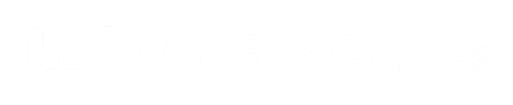
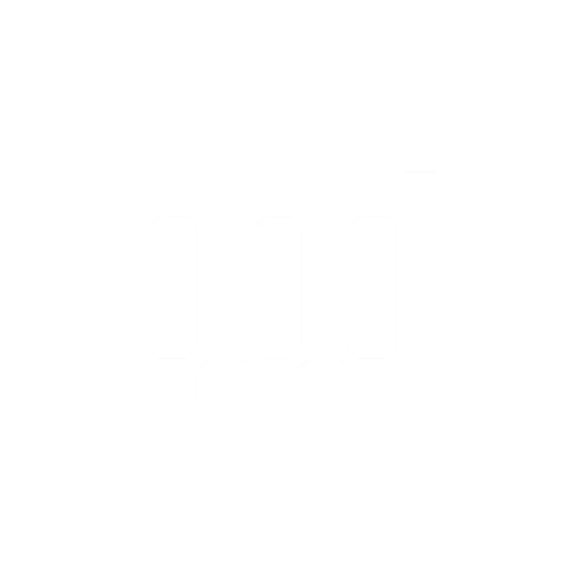

# 🎮 WorkBestGames - Site Portfólio

Um site de portfólio moderno e responsivo para a empresa de desenvolvimento de jogos WorkBestGames, criado com HTML5, CSS3 e JavaScript vanilla.



## 🌟 Visão Geral

O site WorkBestGames é uma vitrine digital elegante que apresenta os serviços, projetos e experiência da empresa no desenvolvimento de jogos. Com um design futurista em tons de roxo e preto, o site oferece uma experiência interativa e envolvente para visitantes e potenciais clientes.

## 🚀 Demo

Acesse o site em: **https://workbestgames.com/**

Ou rode localmente:
```bash
# Clone o repositório
git clone https://github.com/g-arezi/Workbestgames.git

# Navegue até o diretório
cd Workbestgames

# Inicie um servidor local
python -m http.server 8000

# Acesse http://localhost:8000
```

## ✨ Características

### 🎨 Design Moderno
- **Tema Roxo & Preto**: Paleta de cores futurista com gradientes dinâmicos
- **Tipografia Gaming**: Fontes Orbitron e Rajdhani para um visual tecnológico
- **Animações Fluidas**: Transições suaves e efeitos de hover envolventes
- **Elementos Flutuantes**: Formas geométricas animadas para dinamismo

### 📱 Totalmente Responsivo
- **Mobile First**: Otimizado para dispositivos móveis
- **Design Adaptativo**: Funciona perfeitamente em desktop, tablet e smartphone
- **Menu Hambúrguer**: Navegação intuitiva em telas menores
- **Imagens Otimizadas**: Carregamento rápido em todas as resoluções

### 🛠️ Funcionalidades Interativas
- **Navegação Suave**: Scroll animado entre seções
- **Filtros de Portfólio**: Sistema de filtros dinâmicos (Mobile, PC, Web)
- **Formulário de Contato**: Validação em tempo real com notificações
- **Contadores Animados**: Estatísticas que animam quando visíveis
- **Efeitos Parallax**: Movimentação de background baseada no scroll

## 📁 Estrutura do Projeto

```
Workbestgames/
├── 📄 index.html          # Estrutura HTML principal
├── 🎨 styles.css          # Estilos CSS com tema roxo/preto
├── ⚡ script.js           # JavaScript para interatividade
├── 📁 img/                # Pasta de imagens
│   ├── logo_wbg.png       # Logo principal
│   ├── logo_wbgname_1.png # Logo com nome
│   ├── logo_wbgtxt_1.png  # Logo com texto
│   ├── 1748300130112.png  # Imagem do portfólio 1
│   ├── 1748300141963.png  # Imagem do portfólio 2
│   └── 1748305948605.png  # Imagem do portfólio 3
└── 📖 README.md           # Este arquivo
```

## 🎯 Seções do Site

### 🏠 **Home/Hero**
- Apresentação impactante da marca
- Título animado com efeito de gradiente
- Call-to-actions estratégicos
- Background com animações flutuantes

### ℹ️ **Sobre**
- História e missão da empresa
- Estatísticas impressionantes animadas
- Grid responsivo com informações-chave

### 💼 **Portfólio**
- Showcase de projetos desenvolvidos
- Filtros por plataforma (Mobile, PC, Web)
- Cards interativos com overlays
- Links para demonstrações

### 🔧 **Serviços**
- Grid de serviços oferecidos
- Cards com ícones Font Awesome
- Efeitos hover sofisticados
- Descrições detalhadas

### 📞 **Contato**
- Formulário funcional com validação
- Informações de contato completas
- Links para redes sociais
- Sistema de notificações

## 🛠️ Tecnologias Utilizadas

| Tecnologia | Versão | Descrição |
|------------|--------|-----------|
|  | 5 | Estrutura semântica |
|  | 3 | Estilos e animações |
|  | ES6+ | Interatividade |
|  | 6.4.0 | Ícones |
|  | - | Tipografia |

## 🎨 Paleta de Cores

```css
:root {
    --primary-purple: #8B5CF6;      /* Roxo primário */
    --secondary-purple: #A855F7;    /* Roxo secundário */
    --dark-purple: #6D28D9;         /* Roxo escuro */
    --light-purple: #C4B5FD;        /* Roxo claro */
    --black: #000000;               /* Preto base */
    --dark-gray: #111111;           /* Cinza escuro */
    --white: #FFFFFF;               /* Branco para texto */
    --accent-neon: #00D4AA;         /* Verde neon para acentos */
}
```

## 🚀 Como Executar

### Pré-requisitos
- Navegador web moderno
- Servidor web local (Python, Node.js, ou similar)

### Instalação Local

1. **Clone o repositório**
   ```bash
   git clone https://github.com/g-arezi/Workbestgames.git
   ```

2. **Navegue até o diretório**
   ```bash
   cd Workbestgames
   ```

3. **Inicie um servidor local**
   
   **Python:**
   ```bash
   python -m http.server 8000
   ```
   
   **Node.js (http-server):**
   ```bash
   npx http-server -p 8000
   ```
   
   **PHP:**
   ```bash
   php -S localhost:8000
   ```

4. **Acesse no navegador**
   ```
   http://localhost:8000
   ```

## 📱 Compatibilidade

### Navegadores Suportados
- ✅ Chrome 90+
- ✅ Firefox 88+
- ✅ Safari 14+
- ✅ Edge 90+

### Dispositivos Testados
- 📱 **Mobile**: 320px - 768px
- 📟 **Tablet**: 768px - 1024px
- 💻 **Desktop**: 1024px+

## ⚡ Performance

### Métricas de Desempenho
- **First Contentful Paint**: < 1.5s
- **Largest Contentful Paint**: < 2.5s
- **Cumulative Layout Shift**: < 0.1
- **First Input Delay**: < 100ms

### Otimizações Aplicadas
- 🖼️ Imagens otimizadas
- 📦 CSS e JS minificados (produção)
- 🚀 Lazy loading de imagens
- 🎯 Debounce em eventos de scroll
- 📱 Design mobile-first

## 🔧 Personalização

### Alterando Cores
Edite as variáveis CSS em `styles.css`:
```css
:root {
    --primary-purple: #SUA_COR_AQUI;
    --secondary-purple: #SUA_COR_AQUI;
    /* ... outras cores */
}
```

### Adicionando Novos Projetos
1. Adicione a imagem em `img/`
2. Insira o HTML do projeto na seção portfólio
3. Configure o atributo `data-category` para filtros

### Modificando Animações
Ajuste as animações em `script.js` e `styles.css`:
```css
/* Exemplo: Alterando velocidade de transição */
:root {
    --transition-fast: 0.5s ease; /* Era 0.3s */
}
```

## 📝 Licença

Este projeto está sob a licença MIT. Veja o arquivo [LICENSE](LICENSE) para mais detalhes.

## 👥 Contribuições

Contribuições são bem-vindas! Para contribuir:

1. Fork o projeto
2. Crie uma branch para sua feature (`git checkout -b feature/AmazingFeature`)
3. Commit suas mudanças (`git commit -m 'Add some AmazingFeature'`)
4. Push para a branch (`git push origin feature/AmazingFeature`)
5. Abra um Pull Request

## 📞 Contato

**WorkBestGames**
- 🌐 Website: https://workbestgames.com/
- 📧 Email: contato@workbestgames.com


## 🙏 Agradecimentos

- [Font Awesome](https://fontawesome.com/) pelos ícones
- [Google Fonts](https://fonts.google.com/) pelas tipografias
- Comunidade de desenvolvimento web pelas inspirações
- E principalmente equipe da WorkBestGames pela oportunidade de mostrar meu trabalho

---

<div align="center">

**Desenvolvido com ❤️ para gamers por gamers**



**© 2025 WorkBestGames. Todos os direitos reservados.**

</div>